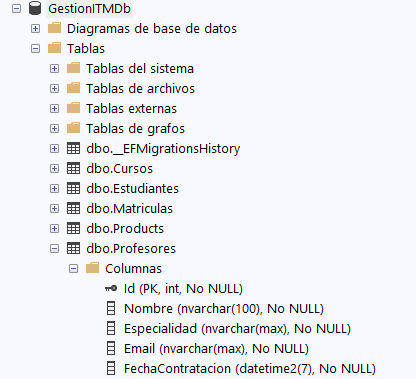
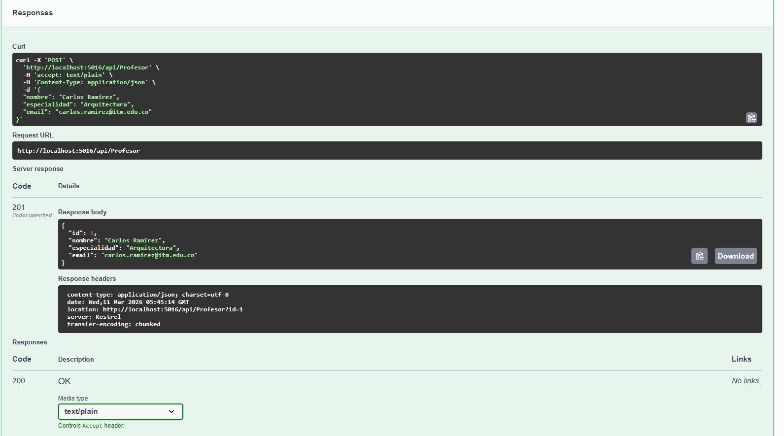
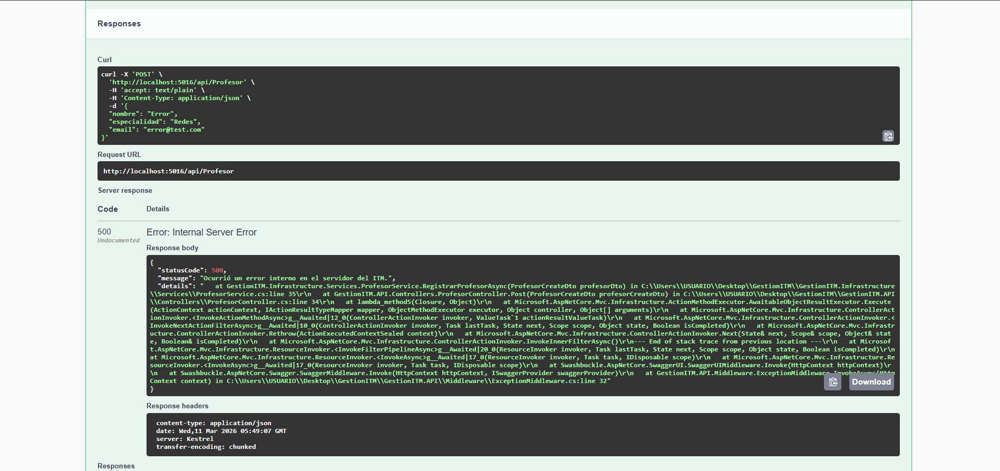
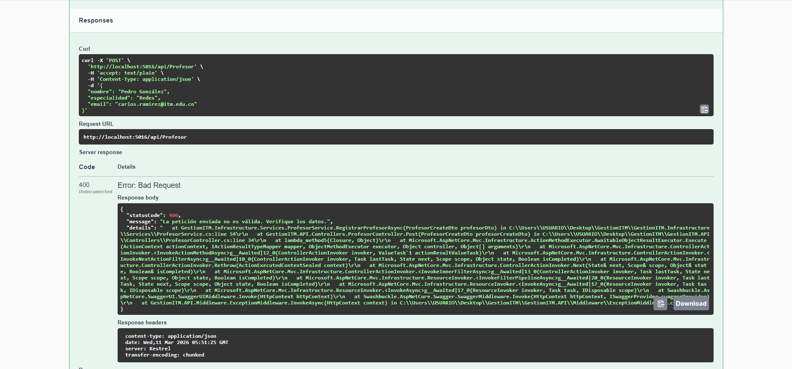
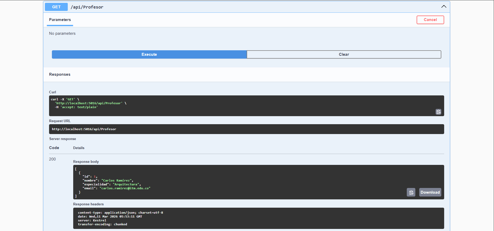
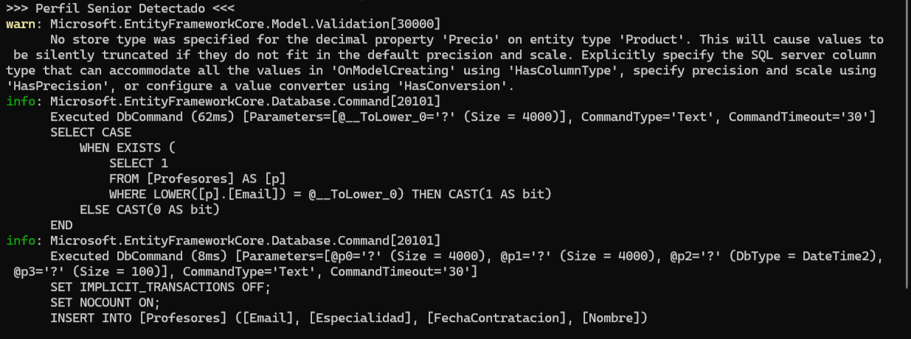

# Módulo Profesores — Taller Nivel 5
### Asignatura: Programación de Software | GestionITM API

---

## ¿Qué se implementó?

Se desarrolló el ciclo de vida completo de la entidad `Profesor` siguiendo la arquitectura **N-Capas (Clean Architecture)** del proyecto GestionITM, respetando estrictamente la separación de responsabilidades entre capas.

La analogía del profesor aplica perfectamente aquí:
- **Controlador** = el mesero (recibe el pedido y lo pasa)
- **Servicio** = el chef (aplica las reglas de negocio)
- **Repositorio** = el almacenista (accede a los datos)

---

## Archivos creados por capa

### GestionITM.Domain (núcleo del sistema)
| Archivo | Descripción |
|---|---|
| `Entities/Profesor.cs` | Entidad de dominio con los campos requeridos |
| `Dtos/ProfesorDto.cs` | DTO de salida — **no expone** `FechaContratacion` |
| `Dtos/ProfesorCreateDto.cs` | DTO de entrada para el POST |
| `Interfaces/IProfesorRepository.cs` | Contrato de datos con método bonus `ExisteEmailAsync` |
| `Interfaces/IProfesorService.cs` | Contrato de negocio |

### GestionITM.Infrastructure (acceso a datos y lógica)
| Archivo | Descripción |
|---|---|
| `Repositories/ProfesorRepository.cs` | Implementación concreta con EF Core |
| `Services/ProfesorService.cs` | Lógica de negocio, validaciones y reglas |

### GestionITM.API (capa de presentación)
| Archivo | Descripción |
|---|---|
| `Controllers/ProfesorController.cs` | Endpoints GET y POST |

### Archivos modificados
| Archivo | Cambio realizado |
|---|---|
| `Mappings/MappingProfile.cs` | Se agregaron los mapeos de `Profesor` ↔ DTOs |
| `ApplicationDbContext.cs` | Se agregó `DbSet<Profesor> Profesores` |
| `Program.cs` | Se registraron `IProfesorRepository` e `IProfesorService` |
| `Domain/Models/ErrorResponse.cs` | Se corrigió el modificador de acceso a `public` |

---

## Entidad Profesor

```csharp
public class Profesor
{
    public int Id { get; set; }

    [Required]
    [MaxLength(100)]
    public string Nombre { get; set; }

    public string Especialidad { get; set; }

    [Required]
    public string Email { get; set; }

    public DateTime FechaContratacion { get; set; }
}
```

---

## Reglas de negocio implementadas en ProfesorService

| Regla | Comportamiento |
|---|---|
| Especialidad vacía | Lanza `ArgumentException` → Middleware responde `400 Bad Request` |
| Especialidad = "Arquitectura" | Imprime en consola `>>> Perfil Senior Detectado <<<` |
| Nombre = "Error" | Lanza `Exception` → Middleware responde `500 Internal Server Error` |
| Email duplicado (**Bonus Nivel 5**) | Lanza `ArgumentException` → Middleware responde `400 Bad Request` |

---

## Inyección de Dependencias (Program.cs)

```csharp
// Profesor — registrado como Scoped (una instancia por petición HTTP)
builder.Services.AddScoped<IProfesorRepository, ProfesorRepository>();
builder.Services.AddScoped<IProfesorService, ProfesorService>();
```

El controlador **nunca inyecta el repositorio directamente**, solo el servicio:

```csharp
public ProfesorController(IProfesorService service)
{
    _service = service;
}
```

---

## AutoMapper — sin asignaciones manuales

```csharp
// MappingProfile.cs
CreateMap<Profesor, ProfesorDto>();
CreateMap<ProfesorCreateDto, Profesor>();
```

No existe ninguna línea del tipo `dto.Nombre = entidad.Nombre` en el proyecto.

---

## Migración aplicada

La tabla `Profesores` fue generada mediante EF Core con los siguientes comandos:

```powershell
dotnet ef migrations add AddProfesorTable --project GestionITM.Infrastructure --startup-project GestionITM.API

dotnet ef database update --project GestionITM.Infrastructure --startup-project GestionITM.API
```

---

## Evidencias

### 1. Tabla creada en SQL Server

Se puede verificar la tabla `dbo.Profesores` con sus columnas en SQL Server Management Studio.



---


### 2. Primer dato a ingresar (Try it out swagger)

Se registró el profesor **Carlos Ramírez** con especialidad **Arquitectura**.


---

### 3. POST exitoso en Swagger (201 Created)

Se registró el profesor **Carlos Ramírez** con especialidad **Arquitectura**.
La API respondió con código `201 Created` y el objeto creado en formato JSON.



---

### 4. Middleware capturando el error (500 Internal Server Error)

Se envió `"nombre": "Error"` para activar el `throw new Exception("Error de prueba")` en el servicio.
El `ExceptionMiddleware` capturó la excepción y devolvió el JSON estandarizado con código `500`.



---

### 5. Email duplicado — 400 Bad Request

Se intentó registrar un profesor con un email ya existente en la base de datos.
El `ExceptionMiddleware` capturó la `ArgumentException` y devolvió código `400 Bad Request`.



---
---

### 6. GET exitoso en Swagger (200 OK)

Se consultaron todos los profesores registrados.
La API respondió con código `200 OK` y la lista de profesores sin exponer `FechaContratacion`.



---

### 7. Perfil Senior Detectado en consola

Al registrar un profesor con `"especialidad": "Arquitectura"`, el servicio imprimió automáticamente en la consola el mensaje de log requerido.



---

## Endpoints disponibles

| Método | Ruta | Descripción |
|---|---|---|
| `GET` | `/api/profesor` | Devuelve todos los profesores (sin `FechaContratacion`) |
| `POST` | `/api/profesor` | Registra un nuevo profesor con validaciones de negocio |

### Ejemplo de request POST

```json
{
  "nombre": "Carlos Ramírez",
  "especialidad": "Arquitectura",
  "email": "carlos.ramirez@itm.edu.co"
}
```

### Ejemplo de respuesta exitosa (201 Created)

```json
{
  "id": 1,
  "nombre": "Carlos Ramírez",
  "especialidad": "Arquitectura",
  "email": "carlos.ramirez@itm.edu.co"
}
```

---

## Bonus Nivel 5 — Validación de Email único

Antes de insertar un profesor, el servicio consulta la base de datos para verificar que el email no esté registrado:

```csharp
var emailEnUso = await _repository.ExisteEmailAsync(profesorDto.Email);
if (emailEnUso)
{
    throw new ArgumentException($"Ya existe un profesor registrado con el email '{profesorDto.Email}'.");
}
```

Si se intenta registrar un email duplicado, el Middleware responde con `400 Bad Request`.
